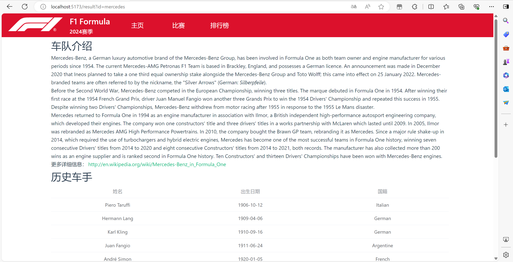
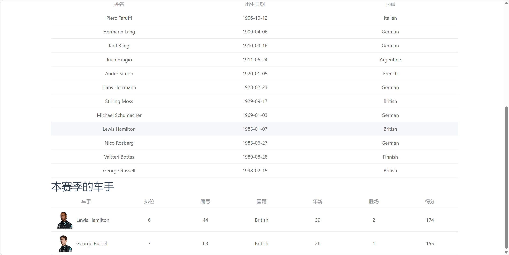
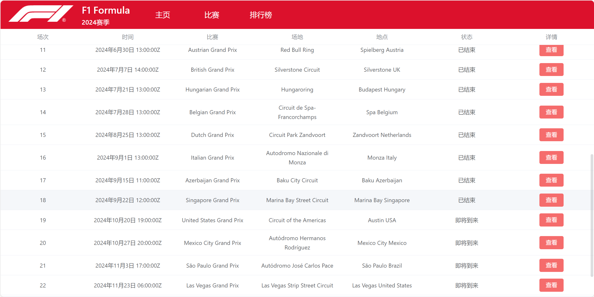
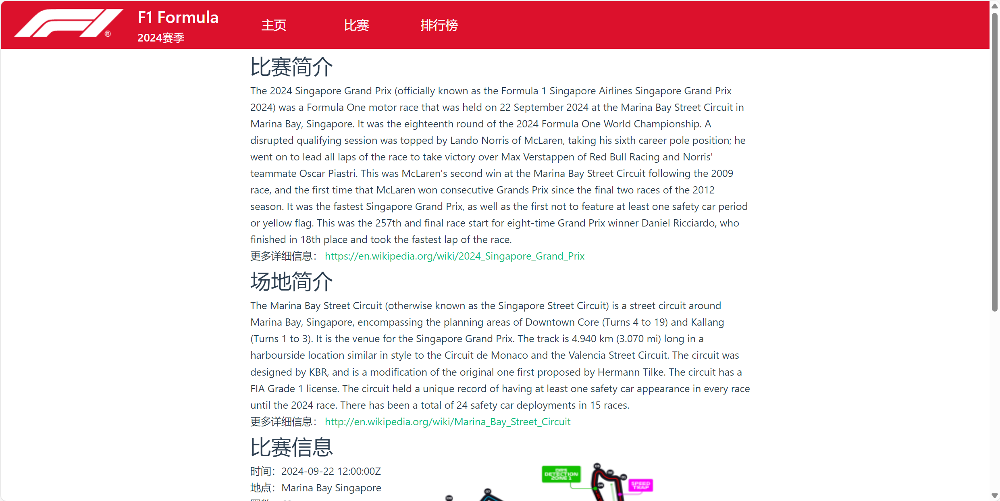
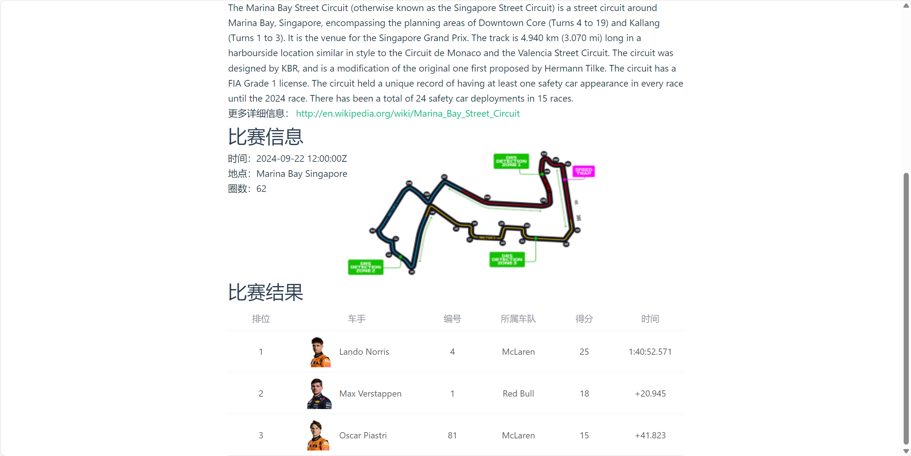
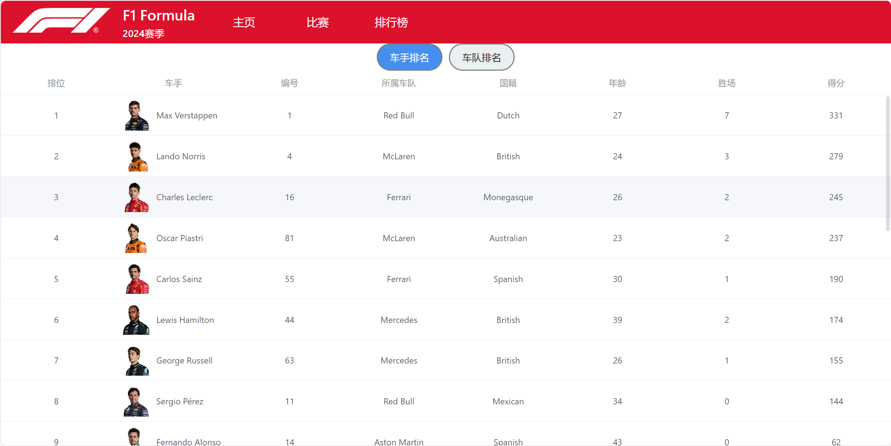
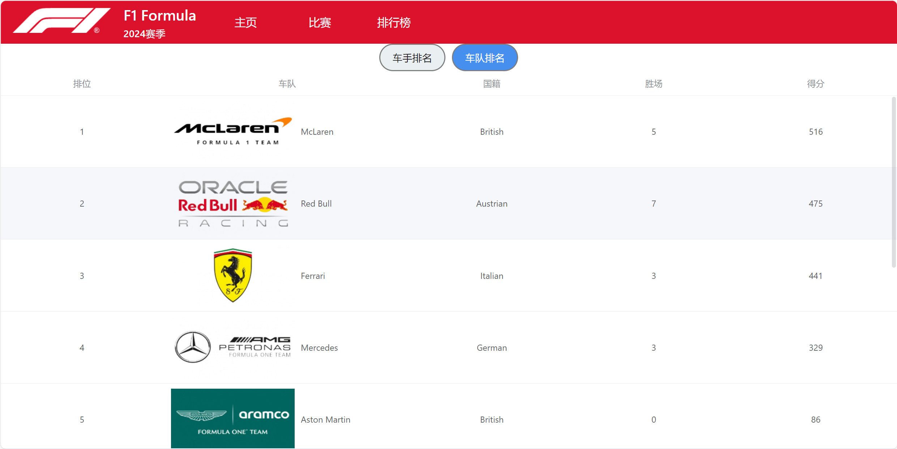

# F1 Formula信息平台

同济大学软件学院微服务架构课程的个人作业，自由选题，使用vue3和node搭建的简易F1赛事信息平台，包括以下内容：
* 各大车队的简介，包括历史成绩和最新动态。
* 赛季的详细赛程和比赛结果。
* 选手的赛季表现统计和排名。
* 车队的赛季表现统计和排名。

## 功能

* 通过点击导航栏中的主页到达车队查询的页面，用户可以输入自己感兴趣的参加过F1的车队名称，点击之后会跳转至结果页面，显示搜索的车队信息、历史车手和参加本赛季的车手（如果有的话）。

* 按照时间顺序显示比赛的信息，包含时间、名称、场地、所在城市，点击查看详情后跳转至详情页面，展示比赛简介、场地简介、比赛的圈数、地图和结果。

* 按照积分从高到低显示车手信息，包含车手头像、姓名、驾驶车辆的号码、所属车队、国籍、年龄、胜场、积分。

* 按照积分从高到低显示车队信息，包含车队logo、名称、国籍、年龄、胜场、积分。

## API

共使用了4个来源的API：
|名称|url|作用|
|---|---|---|
|jolpica-f1|https://api.jolpi.ca/ergast/f1|获得历史上所有车队的列表、赛季的车队排名、赛季的车手排名、赛季的比赛列表、特定的比赛结果|
|openf1|https://api.openf1.org|获得车手的头像|
|api-sports|https://v1.formula-1.api-sports.io|获得车队的logo、比赛的具体信息和地图|
|wikipedia|https://en.wikipedia.org/w/api.php|获得车队、比赛、比赛场地的详细信息|
