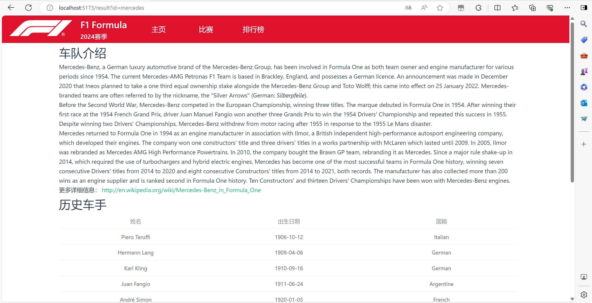
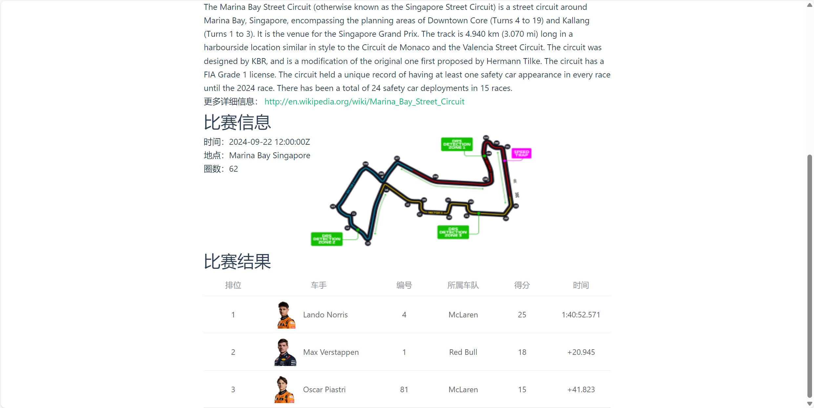
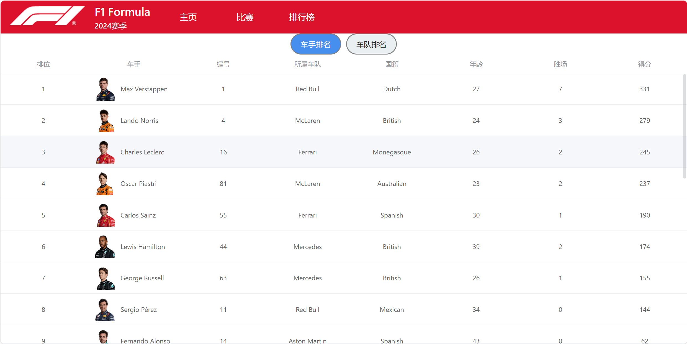

# F1 Formula信息平台

[TOC]

## 项目概述

随着F1赛事的日益普及，车迷对赛季表现、车队动态和选手信息的需求不断增加。
本项目旨在创建一个用户友好的平台，使F1车迷能够方便地查看以下信息：
* 各大车队的简介，包括历史成绩和最新动态。
* 赛季的详细赛程和比赛结果。
* 选手的赛季表现统计和排名。
* 车队的赛季表现统计和排名。
远程仓库地址：https://github.com/SMS-Derfflinger/MicroService

## 功能概述

### 车队信息查询

通过点击导航栏中的主页到达车队查询的页面，用户可以输入自己感兴趣的参加过F1的车队名称，点击之后会跳转至结果页面，显示搜索的车队信息、历史车手和参加本赛季的车手（如果有的话）。




### 比赛信息展示

按照时间顺序显示比赛的信息，包含时间、名称、场地、所在城市，点击查看详情后跳转至详情页面，展示比赛简介、场地简介、比赛的圈数、地图和结果。




### 车手排行榜

按照积分从高到低显示车手信息，包含车手头像、姓名、驾驶车辆的号码、所属车队、国籍、年龄、胜场、积分。


### 车队排行榜

按照积分从高到低显示车队信息，包含车队logo、名称、国籍、年龄、胜场、积分。


## 项目设计与实现

### 项目设计

使用Vue.js 3.0搭建前端界面，并通过axios发送请求调用api，使用Node.js搭建后端。
项目结构：
```
src
├── App.vue
├── assets
│   ├── F1.png
│   ├── background.avif
│   ├── base.css
│   ├── f1_logo.png
│   ├── logo.svg
│   └── main.css
├── components
│   ├── CircuitInfo.vue
│   ├── CurrentDriver.vue
│   ├── DriverRanking.vue
│   ├── Header.vue
│   ├── HistoryDriver.vue
│   ├── QueryResult.vue
│   ├── RaceInfo.vue
│   ├── RaceIntro.vue
│   ├── RaceList.vue
│   ├── RaceResult.vue
│   └── TeamRanking.vue
├── main.js
├── pages
│   ├── MainView.vue
│   ├── QueryResultsView.vue
│   ├── RaceResultView.vue
│   ├── RaceView.vue
│   └── RankingView.vue
└── router.js
```

### 调用的API

共使用了4个来源的API，作用如下：
|名称|url|作用|
|---|---|---|
|jolpica-f1|https://api.jolpi.ca/ergast/f1|获得历史上所有车队的列表、赛季的车队排名、赛季的车手排名、赛季的比赛列表、特定的比赛结果|
|openf1|https://api.openf1.org|获得车手的头像|
|api-sports|https://v1.formula-1.api-sports.io|获得车队的logo、比赛的具体信息和地图|
|wikipedia|https://en.wikipedia.org/w/api.php|获得车队、比赛、比赛场地的详细信息|

调用方式如下：
* https://api.jolpi.ca/ergast/f1: 
```javascript
  const option = {
    url: "https://api.jolpi.ca/ergast/f1/2024/" + route.query.id,
  };
  try {
    const response = await axios.request(option);
    ...
  } catch (error) {
    console.error(error);
  }
```
* https://api.openf1.org: 同上
* https://v1.formula-1.api-sports.io: 需要申请api key
```javascript
const option = {
    url: "https://v1.formula-1.api-sports.io/rankings/teams?season=2024",
    method: "GET",
	  headers: {
		  "x-rapidapi-host": "v1.formula-1.api-sports.io",
		  "x-rapidapi-key": "3560aa0b216bf9a4d7c5b1be7cb60365",
    },
  };
  try {
    const response = await axios.request(option);
    ...
  } catch (error) {
    console.error(error);
  }
```
* https://en.wikipedia.org/w/api.php: 
```javascript
try {
    const response = await fetch(`https://en.wikipedia.org/w/api.php?action=query&format=json
    &titles=${circuitName.value}&prop=extracts&exintro&explaintext&origin=*&redirects=1`);
    const data = await response.json();
    const page = Object.values(data.query.pages)[0];
    ...
  } catch (error) {
    console.error(error);
  }
```

## 附录： API

|名称|url|文档|
|---|---|---|
|jolpica-f1|https://api.jolpi.ca/ergast/f1|https://github.com/jolpica/jolpica-f1|
|openf1|https://api.openf1.org|https://openf1.org|
|api-sports|https://v1.formula-1.api-sports.io|https://api-sports.io/documentation/formula-1/v1|
|wikipedia|https://en.wikipedia.org/w/api.php|https://www.mediawiki.org/wiki/API:Main_page|
