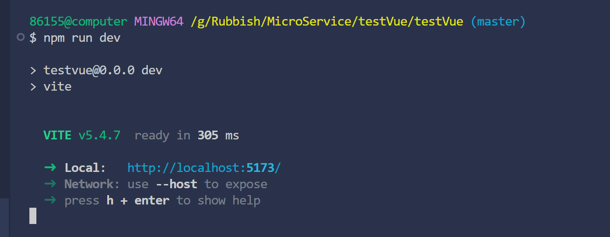

# 配置和部署说明

* 在node官网[Node](https://nodejs.org/en/download/)上下载node.js并安装在本机上
* 使用`npm install vue -g`安装Vue
* 使用`npm install -g @vue/cli`安装Vue CLI
* 使用`vue create project`创建项目并运行，其中的相关的配置信息随意选择即可
* 安装依赖，本项目使用了axios，route，Element Plus，使用`npm install axios`,`npm install vue-router`,`npm install element-plus --save`安装
* 在terminal中运行npm run dev，后点击出现的链接即可

